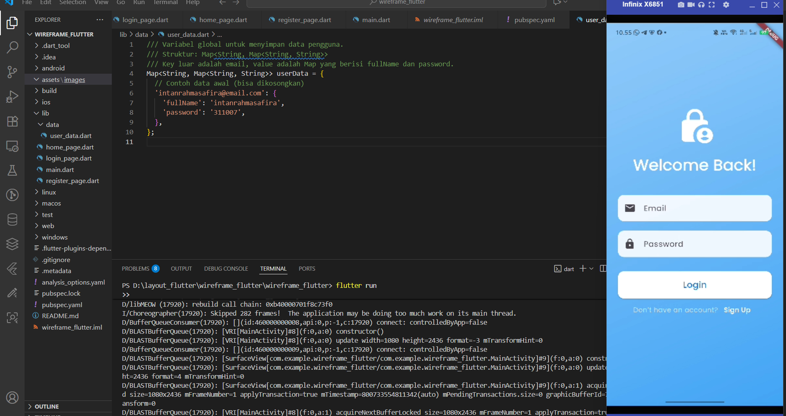
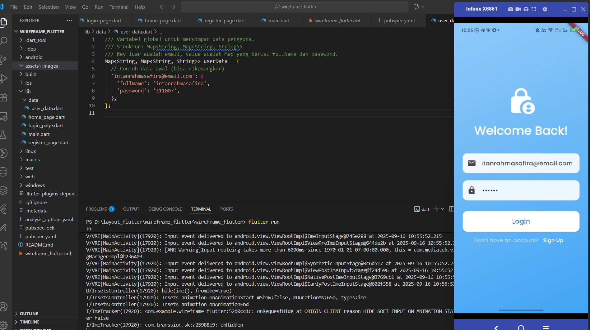
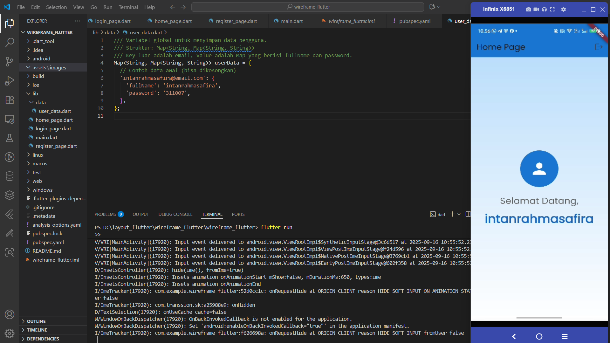
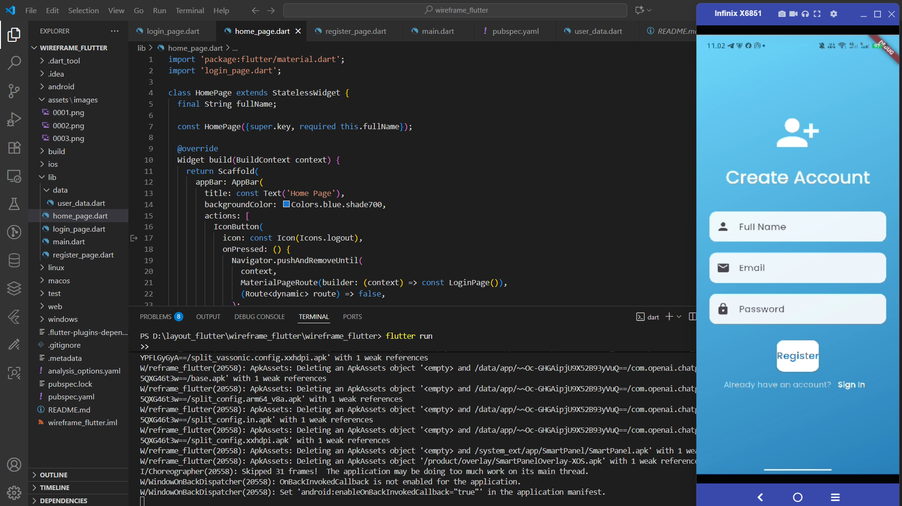
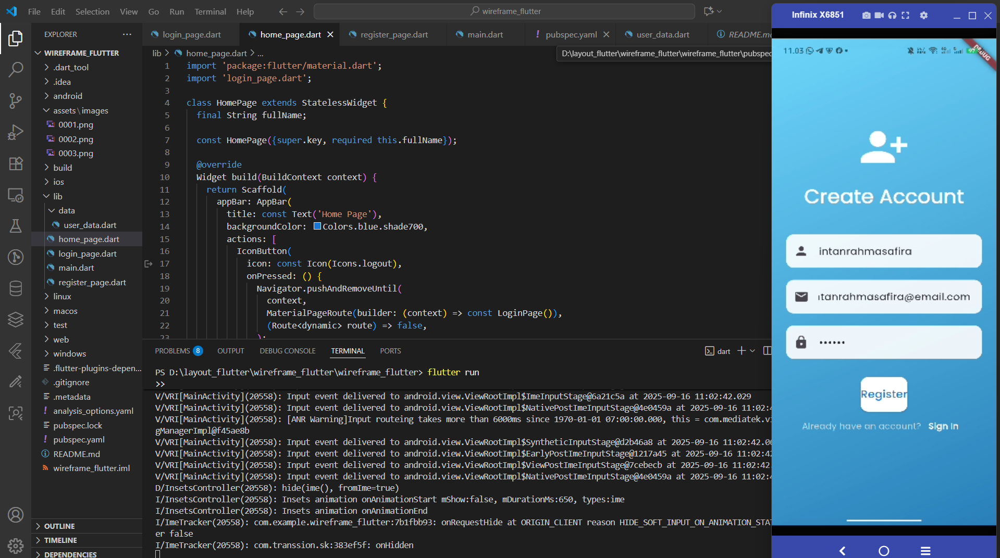
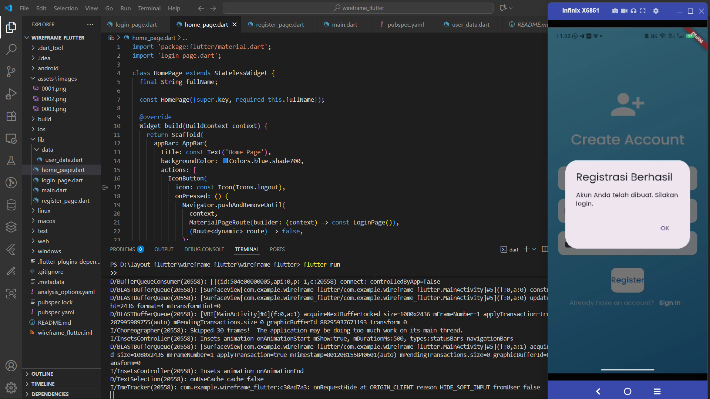

# wireframe_flutter

A new Flutter project.

## Getting Started

## Pendahuluan

   Di praktikum ini kita belajar bikin aplikasi sederhana pakai Flutter dengan fitur Login dan Registrasi. Aplikasi ini tujuannya buat latihan cara bikin tampilan (UI) yang enak dilihat, gimana cara ngatur input dari pengguna, sama pindah-pindah halaman (navigasi) di Flutter. Jadi lewat praktikum ini kita bisa lebih paham dasar-dasar bikin aplikasi mobile sederhana.

## hasil wireframe

## kesimpulan

    Dari praktikum ini kita jadi ngerti gimana cara bikin aplikasi Flutter yang punya fitur Login dan Registrasi. Kita bisa belajar bikin tampilan aplikasi, ngatur input dari user, sama pindah halaman antar screen. Intinya, praktikum ini ngebantu buat lebih paham dasar-dasar bikin aplikasi mobile sederhana pakai Flutter.

This project is a starting point for a Flutter application.

A few resources to get you started if this is your first Flutter project:

- [Lab: Write your first Flutter app](https://docs.flutter.dev/get-started/codelab)
- [Cookbook: Useful Flutter samples](https://docs.flutter.dev/cookbook)

For help getting started with Flutter development, view the
[online documentation](https://docs.flutter.dev/), which offers tutorials,
samples, guidance on mobile development, and a full API reference.
